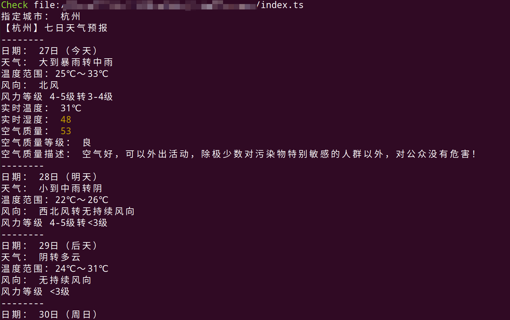

# Deno获取指定或基于IP的城市的天气

一个使用deno直接运行的ts脚本，来获取指定或基于IP所在地的城市的7天天气预报。

## 演示

```sh
deno run --allow-net index.ts --city 杭州
```



## 语法

```sh
deno run --allow-net index.ts [--city xxx]
```

参数说明（参数用`--`前缀标识）：

- deno run index.ts：使用deno运行index.ts文件
- --allow-net：允许ts文件发起网络请求
- --city xxx：【可选】指定城市名称，未指定则获取基于IP的城市

## 教程

需要环境：nodejs

### 全局安装deno

```sh
yarn global add deno
```

### 第一个deno脚本

```sh
mkdir my-deno
cd my-deno
echo "console.log('Hello deno!')"> index.ts
```

解释：

- 新建一个文件夹
- 进入该文件夹
- 写入一行代码到新的ts文件里

在该文件夹下新建终端并运行

```sh
deno run index.ts
```

输出

```sh
Hello deno!
```

### 获取命令行参数

修改index.ts

```ts
import { parse } from "https://deno.land/std@0.61.0/flags/mod.ts";

/** 获取城市输入 */
const args = parse(Deno.args);
const city = args.city;
let isCitySeted = false;
if (typeof city === "string") {
  isCitySeted = true;
  console.log("指定城市：", city);
} else {
  console.log("指定城市：", "基于IP所在地的城市");
}
```

解释：

- 引入网络库里面的格式化方法
- Deno.args获取命令行参数，并格式化成对象
- 获取输入的城市名称
- 判断是否正确获取到城市输入

在该文件夹下新建终端并运行

```sh
deno run --allow-net index.ts --city 杭州
```

参数：

- --allow-net：即`--allow-net true`，开启网络请求权限
- --city 杭州：指定城市名称为杭州

输出：

```sh
Check file:///xxx/index.ts
指定城市： 杭州
```

### 查询天气API

免费的天气API可以使用[tianqiapi.com](http://tianqiapi.com/index) 获取预报数据。只需要用邮箱注册一个免费账户，以获得一个API密钥。[API文档地址](http://tianqiapi.com/index/doc?version=v1)

**免费七日天气接口请求方式及url：**

- 请求方式：`GET`
- 接口地址：`https://tianqiapi.com/api`

**请求示例**

```
https://tianqiapi.com/api?version=v1&appid=65573146&appsecret=dz7SG7qy
```

继续编辑index.ts，添加：

```ts
/** 查询天气API */
const appid = "your appid";
const appsecret = "your appsecret";

let url = `https://tianqiapi.com/api?version=v1&appid=${appid}&appsecret=${appsecret}`;
if (isCitySeted) {
  url += `&city=${city}`;
}

const res = await fetch(url);
const weatherObj = await res.json();
```

解释：

- 你申请的APPID
- 你申请的APPSecret
- 组合接口url地址
- 判断是否需要添加指定城市参数
- 请求返回响应对象
- 获取响应体里的json对象

运行就可以获取天气数据。

### 输出格式化结果

获取数据后就可以解析格式化输出了。

**响应参数说明**

```txt
参数名	类型	说明	备注
cityid	String	城市ID	
update_time	String	气象台更新时间	
city	String	城市名称	
cityEn	String	城市英文名称	
country	String	国家名称	
countryEn	String	国家英文名称	
data	String	每日数据列表	1-7日，共7组
 ┗ wea	String	天气情况	
 ┗ wea_img	String	天气对应图标	固定9种类型(您也可以根据wea字段自己处理):
xue、lei、shachen、wu、bingbao、yun、yu、yin、qing
 ┗ tem	String	实时温度	
 ┗ tem1	String	高温	
 ┗ tem2	String	低温	
 ┗ win	String	风向	
 ┗ win_speed	String	风力等级	
 ┗ humidity	String	湿度
 ┗ air	String	空气质量	
 ┗ air_level	String	空气质量等级	
 ┗ air_tips	String	空气质量描述
```

继续编辑index.ts，添加：

```ts
/** 输出查询结果 */
console.log(`【${weatherObj.city}】七日天气预报`);

weatherObj.data.forEach((d: any, i: any) => {
  console.log("--------");

  console.log("日期：", d.day);
  console.log("天气：", d.wea);
  console.log("温度范围：" + d.tem2 + ` ～` + d.tem1);
  console.log("风向：", d.win[0] == d.win[1] ? d.win[0] : d.win.join("转"));
  console.log("风力等级", d.win_speed);
  if (i === 0) {
    console.log("实时温度：", d.tem);
    console.log("实时湿度：", d.humidity);
    console.log("空气质量：", d.air);
    console.log("空气质量等级：", d.air_level);
    console.log("空气质量描述：", d.air_tips);
  }
});
```

解释：

- 输出返回的天气信息里的城市名
- 遍历7日预报数据，依次输出对应天气信息，注意只有当天才有额外的实时温湿度和空气质量信息。

在该文件夹下新建终端并运行

```sh
deno run --allow-net index.ts --city 杭州
```

参数：

- --allow-net：即`--allow-net true`，开启网络请求权限
- --city 杭州：指定城市名称为杭州

输出：

```sh
Check file:///xxx/index.ts
指定城市： 杭州
【杭州】七日天气预报
--------
日期： 27日（今天）
天气： 大到暴雨转中雨
温度范围：25℃ ～33℃
风向： 北风
风力等级 4-5级转3-4级
实时温度： 31℃
实时湿度： 48
空气质量： 53
空气质量等级： 良
空气质量描述： 空气好，可以外出活动，除极少数对污染物特别敏感的人群以外，对公众没有危害！
--------
日期： 28日（明天）
天气： 小到中雨转阴
温度范围：22℃ ～26℃
风向： 西北风转无持续风向
风力等级 4-5级转<3级
--------
日期： 29日（后天）
天气： 阴转多云
温度范围：24℃ ～31℃
风向： 无持续风向
风力等级 <3级
--------
日期： 30日（周日）
天气： 小雨转晴
温度范围：26℃ ～32℃
风向： 无持续风向
风力等级 <3级
--------
日期： 31日（周一）
天气： 小雨
温度范围：25℃ ～32℃
风向： 东北风转西北风
风力等级 3-4级转4-5级
--------
日期： 1日（周二）
天气： 小雨
温度范围：26℃ ～31℃
风向： 西北风
风力等级 6-7级转4-5级
--------
日期： 2日（周三）
天气： 小雨转晴
温度范围：22℃ ～32℃
风向： 西北风转无持续风向
风力等级 4-5级转<3级
```


## 总结

从个人体验来讲，Deno使用起来还是有其特点的，除了权限控制，还有一些优缺点比如：

### 优点

- 直接引入网络库
- 直接运行无需手动先编译ts

### 缺点

- 缺少一些类型声明文件，如Deno本身
- 无需async会引起IDE语法报错，与常规语法冲突

当然，传统的nodejs开发自己的命令行工具可以用[commander.js](https://github.com/tj/commander.js)库，可以直接封装一个命令行天气预报程序，感兴趣的童鞋可以自己实践一下。

最后附上源码地址，欢迎点赞收藏~戳 [weather-app](https://github.com/czzonet/weather-app)

## 参考文章

1. [使用Deno构建一个命令行天气预报程序 - 掘金](https://juejin.im/post/6864824992626901005)